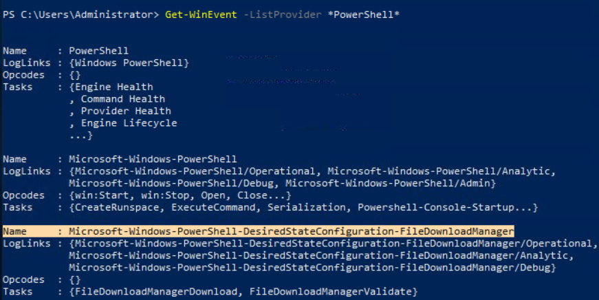
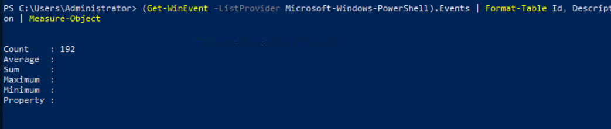

# Objetivo
Compreender seu uso.

---
O **Get-WinEvent** é um cmdlet do PowerShell utilizado para consultar Windows Event Logs e arquivos de Event Tracing, tanto localmente quanto em computadores remotos. Ele permite combinar eventos de diferentes fontes e realizar filtros usando XPath, XML estruturado e FilterHashtable.

Em logs grandes é recomendado usar **-FilterHashtable**, que realiza um filtro diretamente na consulta.

O Get-WinEvent é especialmente útil em SOC e investigação de incidentes, pois permite automatizar consultas, filtrar grandes volumes de eventos e criar scripts para localizar indicadores relevantes com mais eficiência do que a análise manual pelo Event Viewer.

---
# Desafios do lab
1. *Execute o comando do Exemplo 1 (tal como está). Quais são os nomes dos logs relacionados ao OpenSSH?*
> OpenSSH/Admin,OpenSSH/Operational

2. *Execute o comando do Exemplo 8. Em vez da string *Policy*, procure por *PowerShell*. Qual é o nome do terceiro provedor de logs?*
> Get-WinEvent -ListProvider * PowerShell * | levei um tempo pra perceber que era o exemplo 8 do "sheetcode" provido na questão.

3. *Execute o comando do Exemplo 9. Use o Microsoft-Windows-PowerShell como provedor de logs. Quantos IDs de evento são exibidos para esse provedor de eventos?*
> 192 | Só adicionei Measure-Object no final do commando.

4. *Como especificar o número de eventos a serem exibidos?*
> -MaxEvents

5. *Ao usar o parâmetro FilterHashtable e filtrar por nível, qual é o valor de "Informativo"?*
> Dei uma pesquisa rápida e é 4
