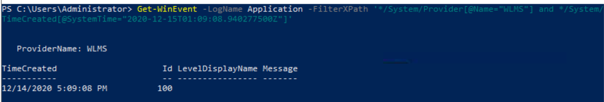

# Objetivo
Compreender o seu uso.

---

XPath (XML Path Language) é utilizado para navegar e filtrar elementos de documentos XML. O Windows Event Log suporta um subconjunto do XPath 1.0, permitindo criar filtros mais específicos para consultas de eventos.

Tanto o Get-WinEvent quanto o wevtutil.exe suportam XPath como mecanismo de filtragem.

Uma consulta XPath começa normalmente com * ou Event e pode seguir a estrutura do XML do evento. O Event Viewer → Details → XML View é útil para identificar os elementos e atributos que podem ser utilizados na construção da consulta.

- Exemplo filtrando pelo Event ID 100:

Get-WinEvent -LogName Application -FilterXPath '*/System/EventID=100'

- Para filtrar pelo Provider Name, é necessário utilizar o atributo Name:

Get-WinEvent -LogName Application -FilterXPath '*/System/Provider[@Name="WLMS"]

- Também é possível filtrar usando os dois parâmetros adicionando **and** após terminar a 1ª filtragem:

...'*/System/EventID=101 **and** */System/Provider[@Name="WLMS"]'

- Elementos dentro de EventData possuem uma sintaxe própria:

...'*/EventData/Data[@Name="TargetUserName"]="System"'

**No contexto de SOC e investigação de incidentes, XPath permite criar consultas mais precisas sobre os eventos, filtrando por Event ID, Provider, atributos e dados específicos do evento, reduzindo significativamente o volume de informações analisadas.**

---
# Desafios do lab

**_Eu não sei o que aconteceu, mas na primeira vez em que completava os exercícios não havia nenhum erro nem desaparecimento de logs, mas enquanto escrevia esta documentação surgiu várias delas. Então irei utilizar imagens de cola do site "Medium" sobre essa room específica._**

1. *Com base no conhecimento adquirido sobre Get-WinEvent e XPath, qual é a consulta para encontrar eventos do WLMS com um horário de sistema de 2020-12-15T01:09:08.940277500Z?*
> Get-WinEvent -LogName Application -FilterXPath '*/System/Provider[@Name="WLMS"] and */System/TimeCreated[@SystemTime="2020-12-15T01:09:08.940277500Z"]' | Tive que pesquisar em qual log ficava armazenado o WLMS.

2. *Using Get-WinEvent and XPath, what is the query to find a user named Sam with an Logon Event ID of 4720?*
> Get-WinEvent -LogName Security -FilterXPath '*/EventData/Data[@Name="TargetUserName"]="Sam" and */System/EventID=4720' | Não sei porque dá erro no powershell mas contou como correto a resposta.

3. *Com base na consulta anterior, quantos resultados são retornados?*
> 2 | Tive que pesquisar já que só retornava erro. Após checar a resposta vi que o comando está correto e que com a outra pessoa apareceu normal, então não sei o porquê disso ter ocorrido.

4. *Com base na resposta da pergunta nº 2, o que é a mensagem?*
> A user account was created | Mesmo jeito da 3.

5. *Ainda trabalhando com Sam como usuário, a que horas o ID de evento 4724 foi registrado? (MM/DD/AAAA H:MM:SS [AM/PM])*
> 12/17/2020 1:57:14 PM | Filtrei o id 4724 pelo Event Viewer e retornou duas entradas com 2 minutos de diferença entre elas. Peguei a 1ª no chute, já que as duas aparentavam a mesma ação. Caso a pesquisa fosse feita pelo PowerShell, ficaria assim: Get-WinEvent -LogName Security -FilterXPath ‘*/EventData/Data[@Name=”TargetUserName”]=”Sam” and */System/EventID=4724’

6. *Qual é o nome do provedor?*
> Microsoft-Windows-Security-Auditing | Chequei pelo Event Viewer na aba System.
